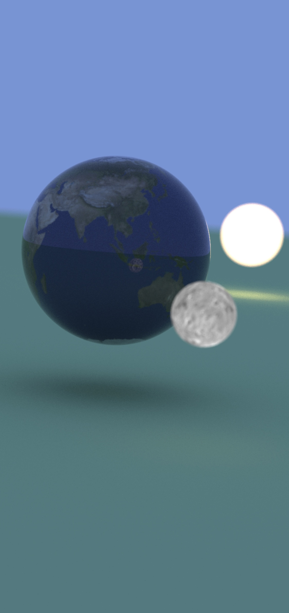

# Ray Tracing in One Weekend implemented on Metal

The work in this repo is mostly a following of this series of excellent tutorials on how to write a toy ray tracer:

* [Ray Tracing in a Weekend](http://www.realtimerendering.com/raytracing/Ray%20Tracing%20in%20a%20Weekend.pdf)
* [Ray Tracing, the Next Week](http://www.realtimerendering.com/raytracing/Ray%20Tracing_%20The%20Next%20Week.pdf)

It's done as an iOS app + Metal.

## Demo

